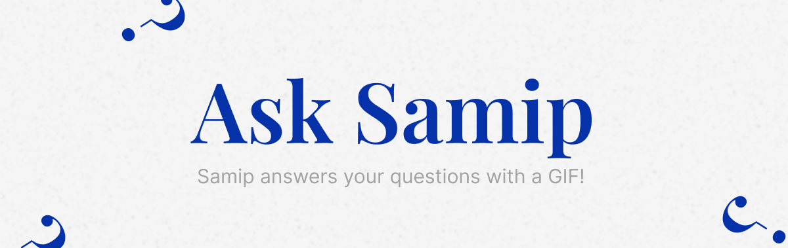

<a href="https://samiptter.herokuapp.com/">
    
</a>

<h2 align="center">Ask Samip | Answering questions with a GIF</h2>

---

## 🌟 What is this?

Ask Samip is a QnA app where you can pass in the question and its answer along with a GIF, through the query params in the url.

The url looks like this:

```
https://asksamip.netlify.app/?q=is-this-the-coolest-app-10
```

As you can see the words in the question should be seperated by "-" and the last two digits determine the answer:

- First digit: It's boolean value that will determine whether the answer is yes or no.
- Second digit _(optional)_: There is a list of GIFs for both yes or no answers. The second digit determines the index of that list. This is optional and if this is not provided the GIF will be picked randomly.

## 🚀 Local Development

First, run the development server:

```bash
npm run dev
# or
yarn dev
```

Open [http://localhost:3000](http://localhost:3000) with your browser to see the result.
